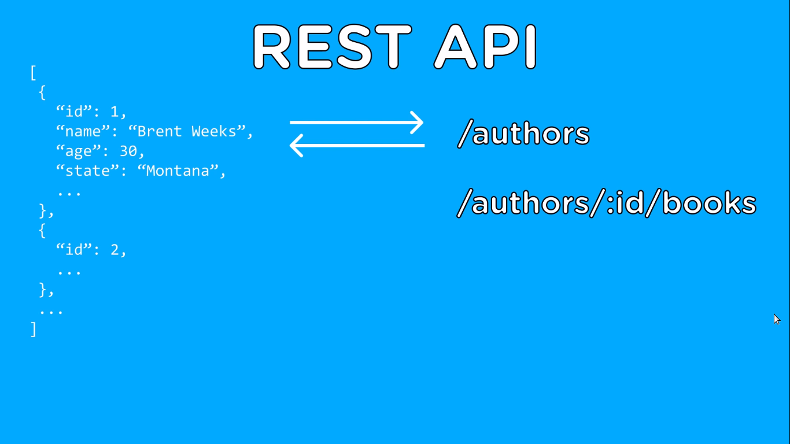
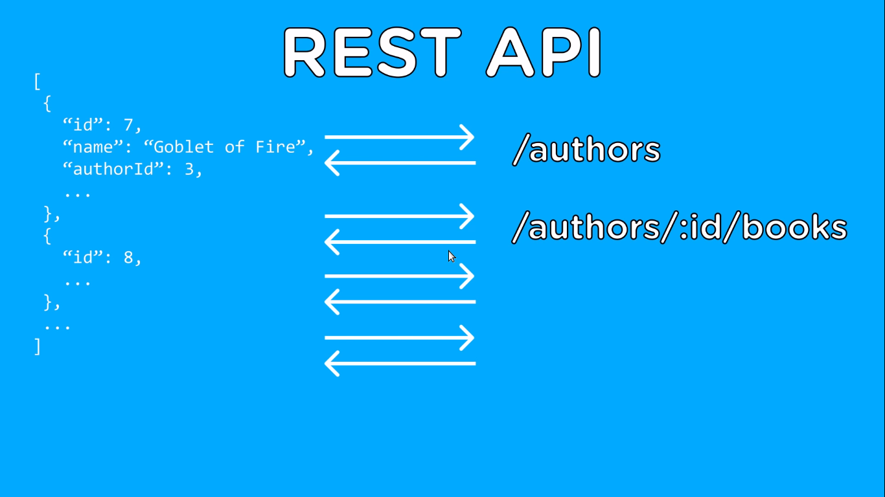
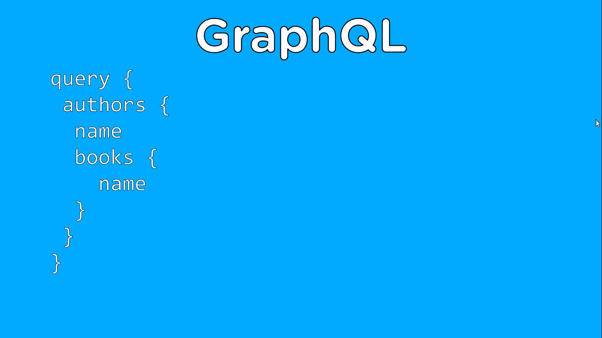
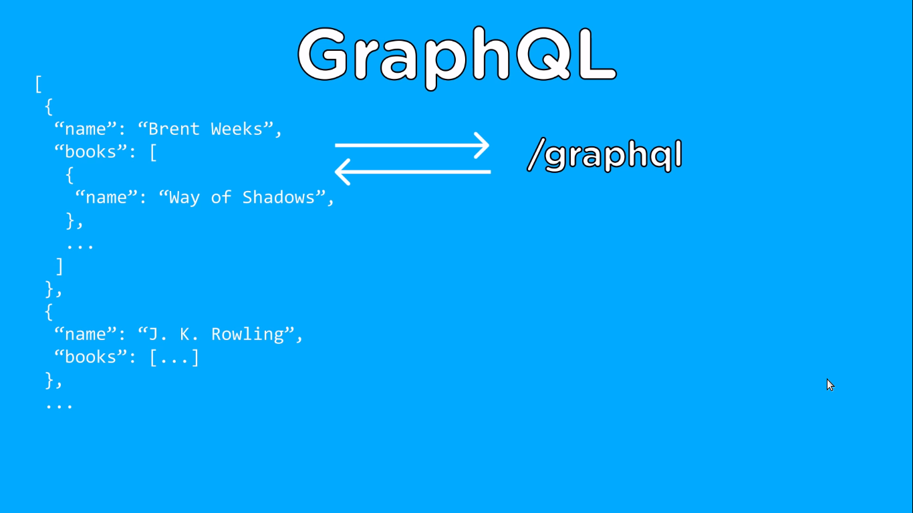

## Learn GraphQL in 40 minutes

We will build a simple server-side API using GraphQL together with Node.js, the original tutorial was presented [here](https://youtu.be/ZQL7tL2S0oQ). Here are the explanations and transcriptions, a few code is included on but the working software developed is in a different repo, [click here](https://github.com/Bodera/learnPath_JavaScript/tree/master/GraphQL_Demos/Authors-and-Books) to go check it yourself.

### A few words about what GraphQL is

If you are completely new to GraphQL you may be thinking that this is a brand new big complex thing, but in fact all GraphQL is a specific way of using tools that we already have. It is just a specification created around HTTP to obtain and receive resources from a server.

Usually you will work on something like REST when interacting with a server, and RESTful endpoints with the HTTP verbs (__POST__, __GET__, __DELETE__ and __UPDATE__), all of these fun things to perform HTTP requests using REST. But GraphQL abstracts the whole idea of REST and all those different endpoints and provides a single endpoint, and the way you determine what data you retrieve from that endpoint is based on the query that you send to it, instead of the endpoint you send the data to. Now, let's look at an example of how a GraphQL query works compared to a REST query to get a better idea of the difference between the two.

### Spike user story

Imagine that you have an application that has books and authors as your two main resources, and each of these resources has maybe 13 fields in each, so let's assume the following you are creating a front-end application where you want to access only the author's name, all books and their names for that particular author and you want to display this in your application as soon as possible to your users.

- Book
  - id
  - Name
  - Genre
  - Page count
  - ISBN
  - authorId

- Author
  - id
  - Name
  - Birth date
  - Location
  

- - - -

Using a typical REST API endpoint as our first choice, we have two endpoints that we can use: the author's endpoint to get all the authors, and then a separate endpoint to get all the books from a particular author.

So, first of all, we need to access the authors endpoint to retrieve a list of all authors and, with this list of authors, we will retrieve the authors ID and the name which is what we want for our application. But we will also receive a lot of extra information, like where the author lives and how old he is, and that’s the kind of thing we don’t really want for this particular page that we’re displaying to our users. Illustration provided below.



Once we have this list of authors, we can have the idea that, for each returning author, we can call the server again to get the books for that particular author, and if we have five authors, we repeat the procedure and we’ll have to call the API five more times to get the books for those authors and every time we call, we return all information related to the books, not just the name but also the ISBN, genre, number of pages, etc. Although all we really want is the name of the book.




You can see that using a REST API to access our data as we are used to, we need to call our API a lot more times than we really want to and we also need to get a lot of extra information back to our server that we don't really need.

- - - -

Now let's see how GraphQL will handle this situation. With GraphQL, what you do is compose a query with exactly the data you want, to inform the GraphQL tool that you want to get a list of all authors (including their names) and also you want to get all books for each one authors (including the books name) you tell GraphQL in a single query, that it will be very small, and then send it to the server, then your GraphQL server will analyze that query and send back exactly that information. 



So, with just one query to the server, you will receive a list of all the authors and their names and a list of all their books and their names and no extra information, you get only the information requested, so you can get as much or as little information as necessary.



- - - -

This is incredibly powerful and is the real reason why GraphQL is relevant, by increasing the query speed. Besides that, it has the ability to not only query specific information, but also nested information, such as books by these authors. 

Without having to call the server more than once, is enough to make it absolutely incredible and this is just the beginning of the power that GraphQL has, since it's  built only with the normal HTTP protocol which we already use, we don’t need to use anything new or sophisticated to start using GraphQL, and that is very cool.

There are also many different libraries out there, for tons of different languages ​​that implement all the features of GraphQL for you in an easy to use way.

Another thing that GraphQL does is it allows you to mutate data on your server so it allows you to __create__, __update__, and __delete__ data just like you could do on a REST API. It also supports errors, so you can handle errors outside of GraphQL and actually does everything a REST API can do, except that it makes working with the front end much easier and lighter weight, as you only need to access the server once each time you need something instead of several times to get all the necessary information.

And now that we have a basic understanding of what GraphQL is and why it is so powerful, let's start by creating a Node.js Express application using GraphQL taking the example of book and author and fully implementing the server side of it.

### Getting your hands dirty

To get started the very first thing that we needed to do is actually set up our webserver which is just going to be a very basic Express server. The full code is provided on a different repository which can be accessed by clicking [here](https://github.com/Bodera/learnPath_JavaScript/tree/master/GraphQL_Demos/Authors-and-Books).

- - - -

* Initialize a Node.js project.
```bash
$ npm init
```

- - - -

* Install the necessary dependencies.
```bash
$ npm i express express-graphql graphql
```

- - - -

* Configure nodemon.
```bash
$ npm i --save-dev nodemon
```

- - - -

* Make sure to add a `devStart` script (or give it other name) into the `package.json` file.
```json
{
    ...
    "main": "server.js",
    "scripts": {
      "devStart": "nodemon server.js",
      "test": "echo \"Error: no test specified\" && exit 1"
    },
    "keywords": [
      "graphql",
      "express"
    ],
    ...
}
```

- - - -

* Start coding the `server.js` file.

```bash
$ touch server.js
```

```javascrit
const express = require('express')
const app = express()

app.listen(8083, () => console.log('Server is up!'))
```

As output for:

```bash
$ npm run devStart
```

You must get a display on the console like:

```bash
Server is up!
```

- - - -

* Adding a GraphQL IDE instance to our server. This is going to give us an user interface to access our GraphQL server without having to manually call it through some GraphQL/REST client.

```javascrit
//...
//still the same

const expressGraphQL = require('express-graphql')

app.use(
  'graphql',
  expressGraphql({
    graphiql: true
  })
)
//still the same
//...
```

This returns an error when we access the `/graphql` endpoint:

```bash
{"errors":[{"message":"GraphQL middleware options must contain a schema."}]}
```

That's because the way that GraphQL knows which data to access is based on the query that you send, so you have to define a schema of how all of your data interacts together and that schema is what we need to pass into our Express GraphQL function, so that our Express GraphQL tool knows how our graphQL data looks like.

Change the `server.js` once more.

```javascript
//...
//still the same

const {
  GraphQLSchema,
  GraphQLObjectType,
  GraphQLString
} = require('graphql')

const schema = new GraphQLSchema({
  query: new GraphQLObjectType({
    name: 'SimpleDemonstration',
    fields: () => ({
      message: { 
        type: GraphQLString,
        resolve: () => 'Greetings from GraphQL side!'  
      }
    })
  })
})

app.use(
  '/graphql',
  expressGraphQL({
    schema: schema,
    graphiql: true
  })
)

//...
//still the same
```

The `resolve()` function is responsable to tell GraphQL where to get the information from.

> GraphQL is strongly-typed. Given a query, tooling can ensure that the query is both syntactically correct and valid within the GraphQL type system before execution, i.e. at development time, and the server can make certain guarantees about the shape and nature of the response. This makes it easier to build high quality client tools. [This good article](https://reactjs.org/blog/2015/05/01/graphql-introduction.html)

Now you must be able to access the GraphiQL interface.


You can even look at the `docs` section on the right top corner over the screen of GraphiQL. Click on it. This action will expand the documentation explorer, where you are able to navigate the different GraphQL schemas that exists in your application. At this point you have a single <span style="color:red">query</span> named <span style="color:yellow">SimpleDemonstration</span>, if you click on it you will down a level and see what fields are contemplated, there is only a field <span style="color:blue">message</span> which is a <span style="color:yellow">String</span>.

- - - -

* Run your first GraphQL query by writing the statement below on GraphiQL before hitting the hotkey `Ctrl`+`Enter` for run the statement.

```qraphql
query {
  message
}
```

Your output must be like this:

```json
{
  "data": {
    "message": "Greetings from GraphQL side!"
  }
}
```

But if you run only this:
```graqhql
{
  message
}
```

You will notice that the output is the same. So we can infer that, by default, when no keyword is provided GraphQL uses the `query` keyword.

- - - -

* This simple example is enough to allow us to dissect how the `graphql` library works and how to use it properly.

First we have to define a schema:

```javascript
const schema = new GraphQLSchema({
  query: new GraphQLObjectType({
    name: 'SimpleDemonstration',
    fields: () => ({
      message: { 
        type: GraphQLString,
        resolve: () => 'Greetings from GraphQL side!'  
      }
    })
  })
})
```

In this schema we've defined our query section, that in turn defines all the different use cases for querying, in this case we have our `SimpleDemonstration` object. Inside this objects we have the `fields` property, wich represents the different sections of the object, and these sections are what we will use to actually perfom the queries. So the object `SimpleDemonstration` has a `field` named __message__ which is a String and then the returned value from the `resolve()` function will be a simple phrase.

But `resolve()` also comes with arguments: `parent` and `args`. We will learn how to use then as far we evolve our demo application.

- - - -

__Read this paragraph before continue coding!__ This tutorial will not cover database integration, but is important for you learn and test it, so I recommend that you to learn how to work with relational DBMS and non-relational DBMS for you implement these features in the future (I suggest Hasura and Prisma, but of course, you can try native drivers, query builders or ORM's when gaining confidence).

* Let's add some mock data.


